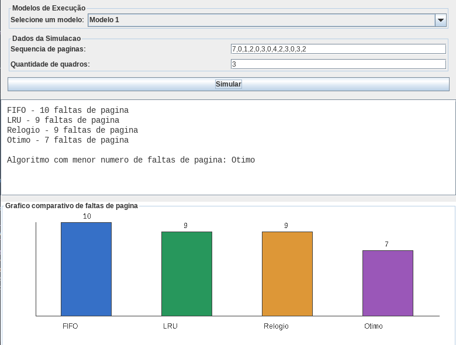

# Simulador de Algoritmos de Substituição de Páginas

Autor 1: Igor Praciano Thomaz

Autor 2: Rafael Lima Cacau


## Resumo

Este trabalho propõe o desenvolvimento de um simulador para avaliar o desempenho de diferentes algoritmos de substituição de páginas em sistemas de gerenciamento de memória virtual. São considerados os principais métodos de seleção de páginas para substituição, e o objetivo é comparar as faltas de página geradas por cada algoritmo.

## Introdução

O gerenciamento eficiente da memória virtual é essencial para o desempenho dos sistemas operacionais. A alocação e a substituição de páginas influenciam diretamente o tempo de resposta dos processos e a utilização dos recursos do sistema. Neste contexto, os algoritmos de substituição de páginas têm papel central na otimização do uso de memória.

Os algoritmos estudados neste projeto incluem:

1. FIFO (First In, First Out)
2. LRU (Least Recently Used)
3. Relógio (Clock)
4. Ótimo
5. NFU (Not Frequently Used)
6. Envelhecimento (Aging)

## Metodologia

O simulador foi desenvolvido em Java e recebe como entrada uma sequência de números inteiros que representam as páginas referenciadas. A implementação contempla quatro métodos de substituição de páginas, com cálculo das faltas de página para cada algoritmo.

Para cada algoritmo, o programa mantém uma estrutura que descreve o estado das páginas na memória e atualiza esse estado sempre que ocorre uma falta de página. Ao final, são exibidos os resultados de cada método.

## Resultados e Discussão

A saída do programa apresenta o total de faltas de página para cada algoritmo, permitindo comparar o desempenho entre eles. Com base nesses resultados, é possível identificar quais algoritmos são mais adequados para diferentes cenários e cargas de trabalho.

## Conclusão

O simulador auxilia na análise de algoritmos de substituição de páginas, demonstrando as diferenças entre abordagens simples como FIFO e soluções mais sofisticadas como LRU, Relógio, Ótimo, NFU e Envelhecimento. A comparação revela como a escolha do algoritmo impacta o número de faltas de página e, por consequência, o desempenho do sistema.

## Como compilar

1. Abra um terminal na pasta do projeto.
2. Garanta que o Java JDK esteja instalado (versão 8 ou superior).
3. Compile todos os arquivos Java:

```bash
javac *.java
```

## Como executar

### Rodando pelo terminal

1. Execute o programa principal:

```bash
java Main
```

2. O `Main` funciona no terminal e solicita os dados diretamente por texto.
3. Digite a sequência de páginas separada por vírgula, por exemplo:

```text
7,0,1,2,0,3,0,4,2,3,0,3,2
```

4. Depois, digite a quantidade de quadros de memória.
5. O programa exibirá no terminal o número de faltas de página para cada algoritmo:
   - FIFO
   - LRU
   - Relógio
   - Ótimo

### Rodando a interface gráfica (Swing)

1. Execute a versão gráfica:

```bash
java SimuladorSwing
```

2. A janela de simulação será exibida.
3. Use os campos para informar:
   - modelo de execução
   - sequência de páginas
   - quantidade de quadros
4. Clique em "Simular".
5. O resultado aparecerá no painel de texto e no gráfico comparativo de faltas de página.

## Exemplo de comparação de caso de teste

A imagem abaixo mostra um exemplo de comparação de resultados para um dos casos de teste:




Link do projeto: https://github.com/IgorPra/Simulador_Algoritmos_Substituicao_Paginas/blob/main/README.md
